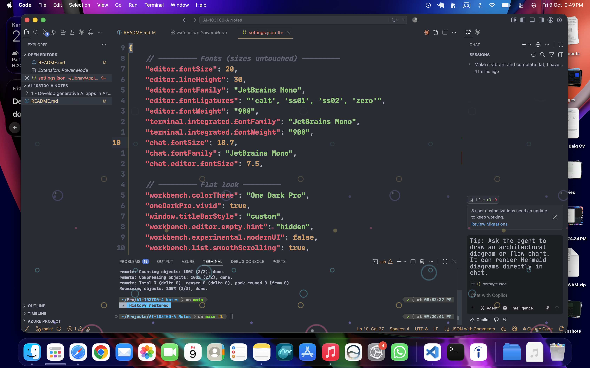

# Flat Fizz

A flat One Dark Pro setup for VS Code with Kurzgesagt-style bubbles fizzing up from the bottom of the window, plus Power Mode explosions when you type.



## What you need

Extensions:

- [One Dark Pro](https://marketplace.visualstudio.com/items?itemName=zhuangtongfa.Material-theme)
- [Custom CSS and JS Loader](https://marketplace.visualstudio.com/items?itemName=be5invis.vscode-custom-css)
- [Power Mode](https://marketplace.visualstudio.com/items?itemName=hoovercj.vscode-power-mode)
- [VSCode Animations](https://marketplace.visualstudio.com/items?itemName=BrandonKirbyson.vscode-animations) (optional, smooth UI transitions)

Font: [JetBrains Mono](https://www.jetbrains.com/lp/mono/)

## Install

```bash
git clone https://github.com/<your-username>/vscode-flat-fizz.git
cd vscode-flat-fizz
./install.sh
```

The script copies `custom/bubbles.css` to `~/.vscode/custom/` and prints the path to use. On Windows, copy the file by hand and use a `file:///C:/Users/<you>/.vscode/custom/bubbles.css` URL.

Then:

1. Open `settings.jsonc` and copy what you want into your own `settings.json`. Don't overwrite your whole file.
2. Put the path from the script into `vscode_custom_css.imports`.
3. Command Palette, run **Enable Custom CSS and JS**, then restart VS Code.

## Heads up

- VS Code will say your installation is "corrupt" after the CSS patch. That's expected, just dismiss it.
- Every VS Code update wipes the patch. Re-run **Enable Custom CSS and JS** after updating.
- The bubbles respect `prefers-reduced-motion` and never block clicks or typing.

## Tweaking the bubbles

Everything is in `custom/bubbles.css`:

- `opacity` on `.monaco-workbench::after` controls how loud they are
- `28s` in the `animation` line controls speed (higher is slower)
- the `rgba(...)` colors are the bubble palette

## License

MIT
